Undertanding Simple Har
===========================

### When you use simplehar, the result should look like this:
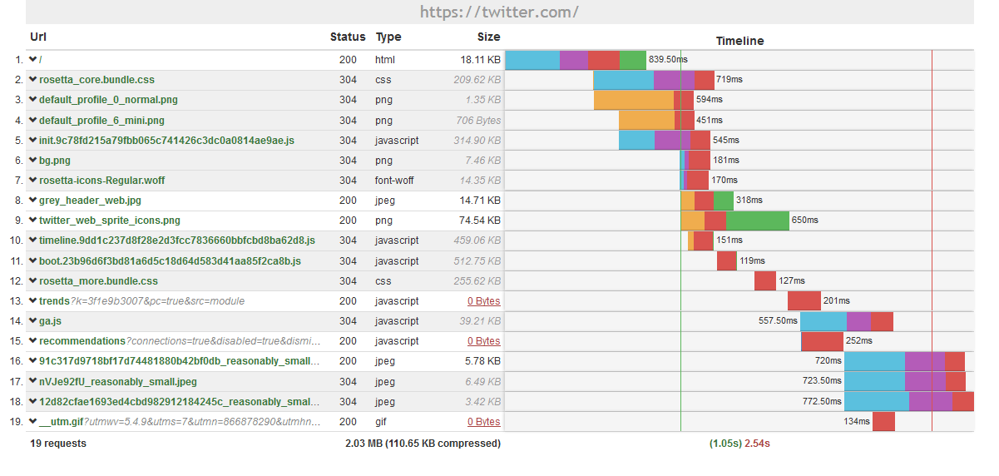

--------------------------

### It have the http status codes, very easy to identify. And all the 3xx status code has the whole line in a gray background:
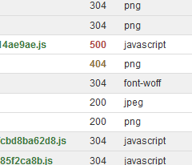

--------------------------

### You can see the difference between http and https requests too:           
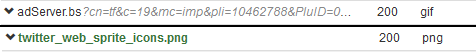

--------------------------

### These are _"symbolic"_ sizes, since the 3xx codes does not download the file itself:       
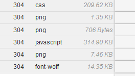

--------------------------

### You can also see the complete information from status, type and size columns:           
                       
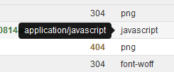                   
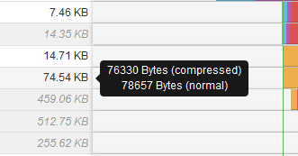

--------------------------

### The mouseover in the file name shows the complete URL. And with middle-click, you can open it in a new tab:
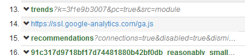

--------------------------

### You can see more informations in the end of the table too:
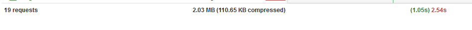

--------------------------

### Every column can be reordered:              
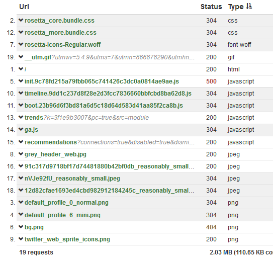

--------------------------

### The DOMContentLoad and Page Load events are displayed as a vertical line in green and red colors:

--------------------------

### You can see all the connection informations and the time spent on it:  
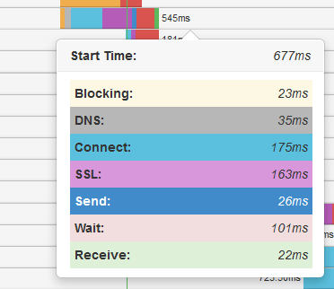

--------------------------

### Clicking in the row, it opens more informations:
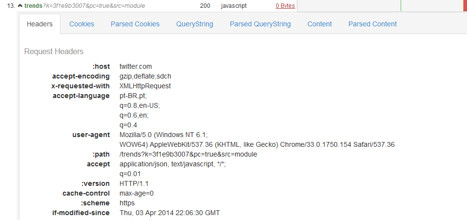

--------------------------

### The Parsed Cookies and QueryString tabs have the `%` symbol converted:
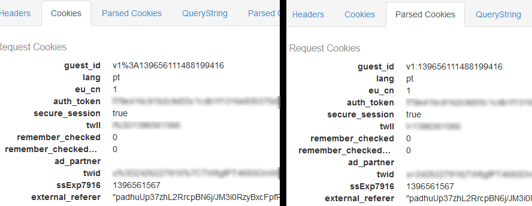

--------------------------

### The Parsed Content tab have the content well formatted and indented:
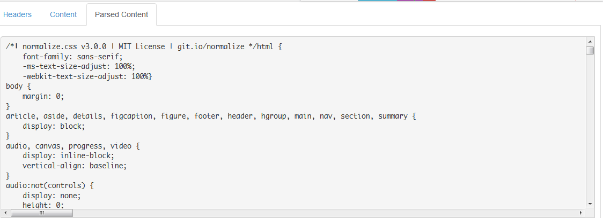

--------------------------

### Or it can show the image of the request:   
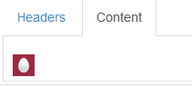